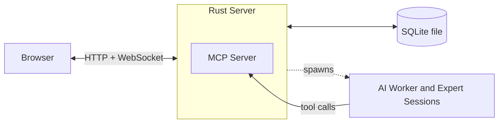

# Architecture

PeckBoard runs as one Rust binary. That binary serves the web interface, stores all data in a single SQLite file, and spawns AI agent sessions that call back into it through a built-in MCP server. This page describes each part and what its tools provide.

In the diagram below, the browser talks to the server over HTTP and a WebSocket, the server reads and writes one SQLite file, and the agent sessions it spawns act on the board through MCP tool calls.

## One Server, One File

The backend is written in Rust. HTTP routes and WebSocket connections are handled by [axum](https://github.com/tokio-rs/axum), an async web framework that runs on the Tokio runtime, so one process serves many browsers and agent sessions concurrently. Data is stored in SQLite through the [Diesel](https://diesel.rs/) ORM. SQLite means the whole database is one self-contained file — there is no separate database server to install, configure, or keep running — and Diesel checks queries against the schema at compile time, so a query that no longer matches the tables fails the build instead of failing at runtime.
The SQLite library, the database migrations, and the built frontend assets are all compiled into the release binary. Installing PeckBoard is therefore copying one executable; beyond a writable data directory, the main thing it needs on the host is a provider for real agent work — typically the Claude Code CLI it spawns.
The SQLite library, the database migrations, and the built frontend assets are all compiled into the release binary. Installing PeckBoard is therefore copying one executable; beyond a writable data directory, the main thing it needs on the host is the Claude Code CLI it spawns.

Backend components in detail

The async runtime is Tokio, with axum 0.8 (and its `ws` feature) on top for routing and WebSockets. Diesel 2 talks to SQLite via a bundled `libsqlite3`, so no system SQLite is needed; schema changes ship as embedded migrations that run on startup. `rust-embed` packs the compiled frontend from `web/dist/` into the release binary. Authentication hashes passwords with Argon2 and issues JWTs; `rcgen` generates a self-signed certificate so the server can also listen over HTTPS, with TLS provided by `rustls` so no OpenSSL is required on the host. Agent backends are pluggable behind an `AgentProvider` trait — providers drive the Claude Code CLI, Grok, Kimi, Cursor, and Ollama, and a mock provider replays scripted scenarios for tests.

## Agent Sessions and the MCP Server

An _agent session_ is an AI process the server spawns and supervises: a _worker session_ completes one card on the board, and an _expert session_ answers questions about one part of the codebase. These sessions need a way to act on the board — create cards, write reports, ask the user a question, consult an expert. They do this over [MCP](https://modelcontextprotocol.io/) (Model Context Protocol), a standard that lets an AI session call tools exposed by another program.

The server embeds its own MCP server as an HTTP endpoint that only accepts connections from the local machine. Each spawned session gets its own access token and an explicit list of allowed tools, so a session holds only the capabilities its role needs. Every tool call lands in the same process that owns the database, which keeps board state changes in one place.

How a session reaches the MCP server

The endpoint is `POST /mcp`, speaking JSON-RPC 2.0, and rejects any caller that is not on loopback. At launch the server writes a per-session MCP config that points the CLI directly at that endpoint over MCP's HTTP transport — no bridge process sits in between. Tokens are issued per session, stored hashed, and carry the session's project and card scope, so a tool call can only touch the board the session belongs to.

## Web Interface

The frontend is React with TypeScript, built with [Vite](https://vite.dev/). TypeScript extends compile-time checking to the UI, and Vite provides fast rebuilds during development plus a static production build the server embeds. Client state lives in [Zustand](https://github.com/pmndrs/zustand) stores, which need no boilerplate beyond plain functions.

The browser keeps a WebSocket open to the server. When anything changes — an agent session emits output, a card moves on the board — the server pushes the event over that socket, so the page updates without polling or reloading.

Frontend libraries in detail

React 19 and TypeScript are built by Vite 8 with `@vitejs/plugin-react`. Zustand 5 holds the stores for sessions, projects, tabs, and the WebSocket connection itself (`web/src/store/ws.ts`). Agent output is rendered with `react-markdown` plus `remark-gfm` and `rehype-highlight` for tables and syntax highlighting. ESLint and Prettier enforce lint and formatting, wired into a pre-commit hook via Husky and lint-staged.

## Tests

Testing happens at two layers. `cargo test` runs Rust unit and integration tests against an in-memory SQLite database, exercising routes and services through their public APIs rather than mocks. [Playwright](https://playwright.dev/) drives a real Chromium browser against the compiled release binary for end-to-end tests; those runs use the mock agent provider instead of a real AI model, so they are deterministic and need no API access.

Test setup in detail

The Rust integration tests in `tests/` boot the application with an in-memory database and cover session lifecycle, card completion, and the mock provider's scripted scenarios; expert consultation now lives with the experts WASM plugin (`tests/experts_plugin.rs`), not core. The Playwright configuration starts `target/release/peckboard` with a fresh temporary data directory for every run, so each suite begins from a clean state. End-to-end specs select mock model ids (for example `mock:happy-path`) to script agent behaviour deterministically.

