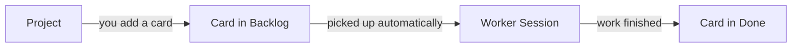

# Core Concepts

PeckBoard turns a folder of code into a board of tasks that AI agents work through. You create a project, add cards describing what you want done, and PeckBoard launches worker sessions that pick the cards up, make the changes — usually code changes in the project's folder — and move them to Done.

## Projects and Folders

A *folder* is a path on your machine that you register once under a name — typically a checked-out repository — and then pick from a list whenever a project, session, or repeating task needs somewhere to work. A *project* is a kanban board attached to one folder: every agent working that project's cards reads and writes files in that folder. When you create a project you give it a name, the folder it works in, a default model, and a *workflow* — the ordered steps its cards pass through.

The Projects view lists every board; opening one shows its cards.

## Cards and the Board

A *card* is one task: a title, a description of what should be done, and a priority from Critical down to Low. The board shows the columns Backlog, In Progress, Review, and Done, plus a Won't Do column for cards that were dropped rather than finished. A new card starts in Backlog, and agents move it across the board as the work progresses — you never have to drag it yourself, though you can.

Cards in Backlog are picked up automatically: as long as the project is active and has a free worker slot, the highest-priority card that is ready to run gets a worker within a few seconds.

How pickup decides which card runs next

Every few seconds PeckBoard checks each active project. A card is ready when no worker is already assigned to it, it is not marked blocked, and every card it depends on is Done. Ready cards are ordered by priority, and workers are started for as many as the project's worker limit allows — the limit is per project (default one), so a project with three ready cards and a limit of one runs them one at a time. If a card's worker crashes twice in a row, the whole project pauses and shows the reason, so a failing card cannot burn through attempts unattended; resuming the project clears the counter.

## Chat Sessions and Worker Sessions

A *session* is one conversation with an agent. A *chat session* is driven by you: you open it from the Sessions list, type messages, and the agent answers. A *worker session* is an agent launched to complete one card on the board — it works autonomously until it finishes the card, hands it to the next step, or gives up. Worker sessions stay out of the Sessions list so they do not drown your chats; while one runs, its card shows a Worker badge on the board, and the card's menu has a View Session item that opens the worker's conversation in the same chat view.

Steps, handoffs, and multi-step workflows

A card's workflow can have more than one working step — for example backlog, in progress, review, done. A worker either finishes the whole card, which moves it straight to Done, or completes just its step and hands off, in which case a fresh worker is started for the next step with a summary of what was done so far. A card that passes through several steps is therefore worked by several workers in turn, each visible from the card.

## Dependencies Between Cards

A card can depend on other cards in the same project. It then waits in Backlog, untouched, until every card it depends on reaches Done — useful when one change must land before another can start. Dependencies are set with the Depends On checkboxes when creating or editing a card.

What a dependency does and does not accept

Only Done satisfies a dependency. A prerequisite moved to Won't Do keeps its dependents waiting forever — drop the dead edge from the dependent's Depends On list to release them. Dependency cycles are rejected when you try to create them, so the graph always has an order in which cards can run.

## Repeating Tasks

A *repeating task* is a saved prompt on a schedule — every N minutes, daily at a set time, or weekly. Each time it fires, PeckBoard starts a fresh session in the task's folder and sends it the prompt; it does not create a card. Use it for recurring chores like a nightly dependency check or a morning summary. The Repeating Tasks view lists each task with its schedule and lets you pause, edit, or run it immediately.

## Reports

A *report* is a markdown document an agent writes for you to read later — a research summary, an audit result, a record of what a worker found. Reports accumulate in the Reports view, grouped by folder, where you can read or download each one. Workers write them with a dedicated tool, so anything worth keeping survives after the session that produced it is gone.

## Where to Go Next

[Experts]({{ "/experts.html" | relative_url }}) covers the long-lived sessions workers consult for answers, and [Architecture]({{ "/architecture.html" | relative_url }}) explains how the server, database, and agents fit together.
