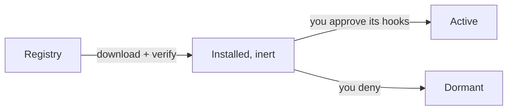

# Plugins

A _plugin_ is a WebAssembly module PeckBoard loads to add tools, pages, and behaviors without changing the core binary — for example a diff viewer tab on every project, or SSH tools for a fleet of servers. Plugins install in a couple of clicks from a built-in registry, and none of a plugin's code runs until you approve exactly the capabilities it asked for. This page covers installing plugins and what each distributed plugin does; [Session Hooks]({{ "/session-hooks.html" | relative_url }}) maps the points where a plugin can hook into a running session.

## Installing and Updating

Open the Plugins panel in Settings to browse the registry. Installing downloads the plugin into the data directory, verifies its checksum and that your PeckBoard version is new enough, and loads it _inert_: it cannot act yet. An approval dialog then lists the exact hooks and permissions the plugin requests — approve to activate it, deny to keep it dormant. Updating an installed plugin follows the same flow, and an agent session can install or update one for you with the `upgrade_plugin` tool.

Where plugins live and how approval is tracked

Installed plugins are single `.wasm` files in `<data-dir>/plugins/`, loaded at startup into a sandbox with no filesystem or network of its own — every capability a plugin uses is a host function gated by a permission it declared. Approval is recorded against the plugin's exact hook set, so an update that asks for _different_ hooks drops back to pending and asks again; an update with unchanged hooks stays approved. Uninstalling deletes the `.wasm` and clears the plugin's stored approval and settings, so a reinstall starts clean.

Plugins that need configuration declare settings fields in their manifest; PeckBoard renders a form for them under Settings → Plugins, and stores values per plugin. The same values can be provided in `config.json` under `plugins.<id>.config`, which wins over the UI on every start.

One historical note: the standard worker tools (file reading and editing, search, git, web fetch, `run_command`, `run_tests`, `math`) were once a plugin called `common-tools` but are now part of core — every session has them with nothing to install.

## What Each Plugin Adds

| Plugin           | What it adds                                                                               |
| ---------------- | ------------------------------------------------------------------------------------------ |
| Experts          | Knowledge, question, and PM expert sessions plus the Experts view                          |
| Pre-hatcher      | Opt-in enrichment of chat messages with repository context before the main model sees them |
| Session Control  | Tools for controlling other sessions: interrupt, terminate, clear, message                 |
| Diff Viewer      | A side-by-side diff and editor tab on projects and sessions                                |
| API              | A public REST API with scoped API keys                                                     |
| Playwright Tests | Replay of recorded browser test runs, LogRocket-style                                      |
| SSH Fleet        | A registry of SSH hosts, remote command and file tools, and a live dashboard               |
| Nginx Manager    | Nginx Proxy Manager control from any session                                               |
| Kaiad Manager    | Kaiad control-plane access from any session                                                |

## Experts

The experts feature — knowledge experts that each read one area of a codebase, the question expert that remembers your answers, and the PM expert that records project decisions — ships as the `experts` plugin. Installing it adds the Experts view and the expert tools (`spin_up_experts`, `ask_expert`, and the `pm_*` decision tools) to sessions. [Experts]({{ "/experts.html" | relative_url }}) describes the feature in full.

## Pre-hatcher

Pre-hatcher offers to enrich a chat message with repository context before your main model sees it. Each message you send gets a small opt-in card; declining sends the message unchanged, accepting spawns a temporary session on the provider's cheapest model (or one you pick in the plugin's settings) that reads the repository, then proposes an expanded version of your message for approval. You always see and approve the final text — the plugin's own code, not a model, delivers it.

What pre-hatcher does and does not intercept

Only plain text messages in chat sessions are intercepted. Worker and expert sessions, messages with attachments, and its own research sessions are always passed through untouched. If the research session finds the message ambiguous, it can ask you one clarifying question first; its answer is folded into the proposed message.

## Session Control

Session Control adds tools a session can use on _other_ sessions: `interrupt_session` cancels an in-flight turn, `terminate_agent` kills a session's agent process, `clear_session` wipes a session's history, `send_message` and `send_image` deliver content into another session as if you had typed it, and `find_session` searches sessions across folders. It is what lets one agent coordinate others — for example a chat session redirecting a subagent it spawned. `clear_session` is irreversible: it deletes the session's event history, todos, and attachments.

## Diff Viewer

Diff Viewer adds a tab on every project and session page that shows, for any git repository in the working folder, a side-by-side diff of every file that differs from `origin/main` — including new files and images. Files are editable in place, so a review that spots a typo can fix it with Save rather than a round-trip through an agent.

## API

The API plugin exposes a public REST API under `/plugin-api/v1/` for reading projects and cards and creating cards from outside PeckBoard — a webhook, a script, another tool. Requests authenticate with API keys carrying `read`, `write`, or `admin` scope; keys are created and revoked from an API Keys page the plugin adds to the user menu, and each secret is shown only once.

## Playwright Tests

Playwright Tests adds a view that replays recorded browser test runs the way session-replay products do: a timeline of user events with rage-click detection, the network waterfall, the console, and a cursor replay with time-scaled playback that skips inactivity. It reads the run recordings PeckBoard's browser testing writes into the data directory, so there is nothing to configure — runs appear as they are recorded.

## SSH Fleet

SSH Fleet keeps a registry of SSH hosts — each with a username and either a password or a private key, plus a label and tags — and gives sessions tools to act on them: `ssh_run` on one host, `ssh_run_many` across a tag or the whole fleet, `ssh_read_file` / `ssh_write_file` / `ssh_edit_file` over SFTP, and `ssh_probe` to check a connection and pin a server key. An SSH Fleet page shows every command live, filterable by host. The SSH client itself is built into PeckBoard core, so credentials stay in memory and are never written to disk.

## Nginx Manager

Nginx Manager connects sessions to a self-hosted [Nginx Proxy Manager](https://nginxproxymanager.com/) instance through the MCP server it ships: `npm_configure` stores the instance's URL and API key, `npm_status` checks the connection, `npm_list_tools` shows what your key's scopes allow, and `npm_call` invokes any of it — proxy hosts, certificates, access lists, and the rest. The catalog is discovered live from your instance, so it always matches your NPM version. Configure it in the plugin's settings form (recommended — the API key never enters a chat transcript) or with `npm_configure` from a session.

## Kaiad Manager

Kaiad Manager is the same bridge for a [Kaiad](https://kaiad.dev) control plane: `kaiad_configure`, `kaiad_status`, `kaiad_list_tools`, and `kaiad_call` proxy to the panel's hosted MCP server for services, deployments, builds, agents, and incidents. It needs an API credential minted in the Kaiad panel with the `mcp.read` scope, plus `mcp.write` if agents should be able to deploy or mutate.

## MCP Server Templates

Besides WASM plugins, the registry lists ready-made MCP server templates — external tool servers such as Playwright, Context7, GitHub, and Notion that sessions can talk to directly. Adding one from the registry configures it for your sessions without hand-writing the server command or URL.
