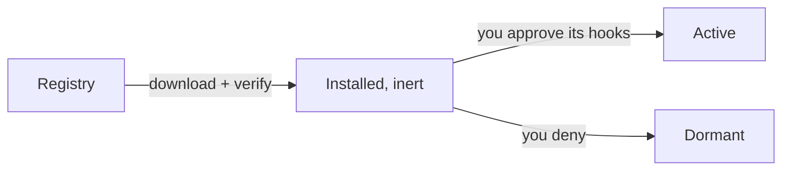

# Plugins

A _plugin_ is a WebAssembly module PeckBoard loads to add tools, pages, and behaviors without changing the core binary — for example a diff viewer on every project, or SSH tools for a fleet of servers. Plugins install in a couple of clicks from a built-in registry, and none of a plugin's code runs until you approve exactly the capabilities it asked for. This page covers installing plugins and lists every plugin in the official registry; each one has its own page with a screenshot, its MCP tools, and its settings. [Session Hooks]({{ "/session-hooks.html" | relative_url }}) maps the points where a plugin can hook into a running session, and the [MCP Server Catalog]({{ "/mcp-servers.html" | relative_url }}) lists the external tool servers the registry can configure alongside plugins.

## Installing and Updating

Open Settings → Plugin Registry to browse the registry. Installing downloads the plugin into the data directory, verifies its checksum and that your PeckBoard version is new enough, and loads it _inert_: it cannot act yet. An approval dialog then lists the exact hooks and permissions the plugin requests — approve to activate it, deny to keep it dormant. Updating an installed plugin follows the same flow, and an agent session can install or update one for you with the `upgrade_plugin` tool.

```mermaid
graph LR
  R[Registry] -->|download + verify| I[Installed, inert]
  I -->|you approve its hooks| A[Active]
  I -->|you deny| D[Dormant]
```

Where plugins live and how approval is tracked

Installed plugins are single `.wasm` files in `<data-dir>/plugins/`, loaded at startup into a sandbox with no filesystem or network of its own — every capability a plugin uses is a host function gated by a permission it declared. Approval is recorded against the plugin's exact hook and permission set, so an update that asks for _different_ capabilities drops back to pending and asks again; an update with unchanged capabilities stays approved. Uninstalling deletes the `.wasm` and clears the plugin's stored approval and settings, so a reinstall starts clean.

Plugins that need configuration declare settings fields in their manifest; PeckBoard renders a form for them on Settings → Plugins — click the plugin's row — and stores values per plugin. The same values can be provided in `config.json` under `plugins.<id>.config`, which wins over the UI on every start.

The AI providers (Claude, Codex, Cursor, Grok, Kimi, Ollama, Mock) are also plugins — first-party ones compiled into the binary, activated from the same registry page. The [Providers]({{ "/providers.html" | relative_url }}) page covers them. One historical note: the standard worker tools (file reading and editing, search, git, web fetch, `run_command`, `run_tests`, `math`) were once a plugin called `common-tools` but are now part of core — every session has them with nothing to install.

## What Each Plugin Adds

Every plugin in the official registry. The name links to the plugin's page, which lists its MCP tools, settings, permissions, and prerequisites.

| Plugin                                                        | What it adds     | MCP tools                                                                                  |
| ------------------------------------------------------------- | ---------------- | ------------------------------------------------------------------------------------------ | --- |
| [Experts]({{ "/experts.html"                                  | relative_url }}) | Knowledge, question, and PM expert sessions plus the Experts view                          | 8   |
| [App Manager]({{ "/plugins/app-manager.html"                  | relative_url }}) | Install and remove developer apps on the host and SSH targets, with a dashboard            | 7   |
| [Chicken Coop]({{ "/plugins/chicken-coop.html"                | relative_url }}) | A 3D chicken run visualizing every live session as a bird                                  | —   |
| [Diff Viewer]({{ "/plugins/diff-viewer.html"                  | relative_url }}) | A side-by-side diff and editor for every repo in the folder, on projects and sessions      | —   |
| [GitHub Bridge]({{ "/plugins/github-bridge.html"              | relative_url }}) | GitHub issues synced with kanban cards, PR links, auto-close on done                       | 4   |
| [Graphify]({{ "/plugins/graphify.html"                        | relative_url }}) | A queryable code knowledge graph per repo, with a visualizer page                          | 3   |
| [Kaiad]({{ "/plugins/kaiad.html"                              | relative_url }}) | Kaiad control-plane access from any session                                                | 4   |
| [Nginx Proxy Manager]({{ "/plugins/nginx-proxy-manager.html"  | relative_url }}) | Nginx Proxy Manager control from any session                                               | 4   |
| [Notifier]({{ "/plugins/notifier.html"                        | relative_url }}) | Lifecycle events forwarded to ntfy, Telegram, Discord, and webhooks                        | —   |
| [OpenAI-Compatible Provider]({{ "/plugins/openai-compat.html" | relative_url }}) | Any `/v1/chat/completions` endpoint as an AI provider                                      | —   |
| [OpenSearch]({{ "/plugins/opensearch.html"                    | relative_url }}) | Query and manage an OpenSearch or Elasticsearch-compatible cluster                         | 8   |
| [Playwright Tests]({{ "/plugins/playwright-tests.html"        | relative_url }}) | Replay of recorded browser test runs, with MP4 export                                      | —   |
| [Pre-hatcher]({{ "/plugins/pre-hatcher.html"                  | relative_url }}) | Opt-in enrichment of chat messages with repository context before the main model sees them | 1   |
| [Project Planner]({{ "/plugins/project-planner.html"          | relative_url }}) | A project definition built by interview, one question per slide                            | 4   |
| [Public API]({{ "/plugins/api.html"                           | relative_url }}) | A public REST API with scoped API keys                                                     | —   |
| [Session Control]({{ "/plugins/session-control.html"          | relative_url }}) | Tools for controlling other sessions, plus goal-driven orchestrators                       | 14  |
| [SSH Fleet]({{ "/plugins/ssh-fleet.html"                      | relative_url }}) | A registry of SSH hosts, remote command and file tools, and a live dashboard               | 10  |
| [UI Gauge]({{ "/plugins/ui-gauge.html"                        | relative_url }}) | UI design scoring against user-ranked baselines, with a learned style prompt               | 5   |

## MCP Server Catalog

Besides WASM plugins, the registry lists ready-made MCP server entries — over a hundred external tool servers such as Playwright, GitHub, Postgres, and Figma that sessions can talk to directly. Adding one from the registry configures it without hand-writing the server command or URL. The full list, grouped by category, is on the [MCP Server Catalog]({{ "/mcp-servers.html" | relative_url }}) page.
