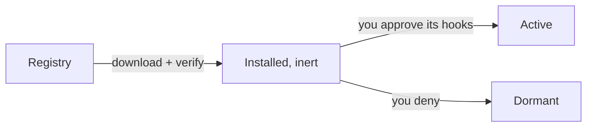

# Plugins

A _plugin_ is a WebAssembly module PeckBoard loads to add tools, pages, and behaviors without changing the core binary — for example a diff viewer tab on every project, or SSH tools for a fleet of servers. Plugins install in a couple of clicks from a built-in registry, and none of a plugin's code runs until you approve exactly the capabilities it asked for. This page covers installing plugins, what each distributed plugin does, and the MCP tools each one gives sessions. [Session Hooks]({{ "/session-hooks.html" | relative_url }}) maps the points where a plugin can hook into a running session, and the [MCP Server Catalog]({{ "/mcp-servers.html" | relative_url }}) lists the external tool servers the registry can configure alongside plugins.

## Installing and Updating

Open Settings → Plugins → Plugin Registry to browse the registry. Installing downloads the plugin into the data directory, verifies its checksum and that your PeckBoard version is new enough, and loads it _inert_: it cannot act yet. An approval dialog then lists the exact hooks and permissions the plugin requests — approve to activate it, deny to keep it dormant. Updating an installed plugin follows the same flow, and an agent session can install or update one for you with the `upgrade_plugin` tool.

```mermaid
graph LR
  R[Registry] -->|download + verify| I[Installed, inert]
  I -->|you approve its hooks| A[Active]
  I -->|you deny| D[Dormant]
```

Where plugins live and how approval is tracked

Installed plugins are single `.wasm` files in `<data-dir>/plugins/`, loaded at startup into a sandbox with no filesystem or network of its own — every capability a plugin uses is a host function gated by a permission it declared. Approval is recorded against the plugin's exact hook set, so an update that asks for _different_ hooks drops back to pending and asks again; an update with unchanged hooks stays approved. Uninstalling deletes the `.wasm` and clears the plugin's stored approval and settings, so a reinstall starts clean.

Plugins that need configuration declare settings fields in their manifest; PeckBoard renders a form for them in the plugin's details modal — open Settings → Plugins and click the plugin's row, then find the Settings section — and stores values per plugin. The same values can be provided in `config.json` under `plugins.<id>.config`, which wins over the UI on every start.

One historical note: the standard worker tools (file reading and editing, search, git, web fetch, `run_command`, `run_tests`, `math`) were once a plugin called `common-tools` but are now part of core — every session has them with nothing to install.

## What Each Plugin Adds

Every plugin in the official registry, with the MCP tools it contributes to sessions. Tool-by-tool detail follows in each plugin's section.

| Plugin           | What it adds                                                                               | MCP tools |
| ---------------- | ------------------------------------------------------------------------------------------ | --------- |
| Experts          | Knowledge, question, and PM expert sessions plus the Experts view                          | 8         |
| Pre-hatcher      | Opt-in enrichment of chat messages with repository context before the main model sees them | —         |
| Session Control  | Tools for controlling other sessions: interrupt, terminate, clear, message                 | 6         |
| Diff Viewer      | A side-by-side diff and editor tab on projects and sessions                                | —         |
| API              | A public REST API with scoped API keys                                                     | —         |
| Playwright Tests | Replay of recorded browser test runs, LogRocket-style                                      | —         |
| Chicken Coop     | A 3D chicken run visualizing every live session as a bird                                  | —         |
| SSH Fleet        | A registry of SSH hosts, remote command and file tools, and a live dashboard               | 10        |
| Nginx Manager    | Nginx Proxy Manager control from any session                                               | 4         |
| Kaiad Manager    | Kaiad control-plane access from any session                                                | 4         |
| OpenSearch       | Query and manage an OpenSearch or Elasticsearch-compatible cluster                         | 8         |

## Experts

The experts feature — knowledge experts that each read one area of a codebase, the question expert that remembers your answers, and the PM expert that records project decisions — ships as the `experts` plugin. Installing it adds the Experts view and the expert tools to sessions. [Experts]({{ "/experts.html" | relative_url }}) describes the feature in full.

| Tool                  | What it does                                                                     |
| --------------------- | -------------------------------------------------------------------------------- |
| `spin_up_experts`     | Partitions a project's codebase across knowledge experts, each reading its slice |
| `list_experts`        | Lists consultable experts with kind, area, scope, and last activity              |
| `ask_expert`          | Asks an expert a question; the answer arrives asynchronously as a later event    |
| `read_expert_brief`   | Reads an expert's distilled brief synchronously — cheap orientation              |
| `record_expert_brief` | Knowledge experts persist their distilled understanding for others to read       |
| `pm_record_decision`  | Records a project-direction decision in the durable PM log                       |
| `pm_check_decisions`  | Checks a planned change against active PM decisions                              |
| `pm_escalate_to_user` | PM expert escalates an unanswerable direction question to the user               |

## Pre-hatcher

Pre-hatcher offers to enrich a chat message with repository context before your main model sees it. Each message you send gets a small opt-in card; declining sends the message unchanged, accepting spawns a temporary session on the provider's cheapest model (or one you pick in the plugin's settings) that reads the repository, then proposes an expanded version of your message for approval. You always see and approve the final text — the plugin's own code, not a model, delivers it. Its one MCP tool (`pre_hatch_result`) is internal plumbing for the research session, not something other sessions call.

What pre-hatcher does and does not intercept

Only plain text messages in chat sessions are intercepted. Worker and expert sessions, messages with attachments, and its own research sessions are always passed through untouched. If the research session finds the message ambiguous, it can ask you one clarifying question first; its answer is folded into the proposed message.

## Session Control

Session Control adds tools a session can use on _other_ sessions — it is what lets one agent coordinate others, for example a chat session redirecting a subagent it spawned.

Same-folder targets run immediately. Cross-folder mutating actions ask the user (*Approve once* / *Approve always* / *Deny*); *Always* is remembered for that controlling session. `find_session` stays folder-blind so agents can discover targets without a prompt. Upgrading past 0.2.0 re-triggers plugin approval because it adds the `ask_user` and `data_store` permissions.

| Tool                | What it does                                                                      |
| ------------------- | --------------------------------------------------------------------------------- |
| `find_session`      | Lists sessions across every folder and project, with an optional substring query  |
| `interrupt_session` | Stops another session's in-flight turn without touching its history               |
| `terminate_agent`   | Kills a session's agent process; the next message starts a fresh one              |
| `clear_session`     | Wipes a session's history, todos, and attachments — irreversible                  |
| `send_message`      | Delivers text into another session as if the user had typed it, and resumes it    |
| `send_image`        | Delivers an image into another session as an attachment, with an optional caption |

## Diff Viewer

Diff Viewer adds a tab on every project and session page that shows, for any git repository in the working folder, a side-by-side diff of every file that differs from `origin/main` — including new files and images. Files are editable in place, so a review that spots a typo can fix it with Save rather than a round-trip through an agent.

## API

The API plugin exposes a public REST API under `/plugin-api/v1/` for reading projects and cards and creating cards from outside PeckBoard — a webhook, a script, another tool. Requests authenticate with API keys carrying `read`, `write`, or `admin` scope; keys are created and revoked from an API Keys page the plugin adds to the user menu, and each secret is shown only once.

## Playwright Tests

Playwright Tests adds a view that replays recorded browser test runs the way session-replay products do: a timeline of user events with rage-click detection, the network waterfall, the console, and a cursor replay with time-scaled playback that skips inactivity. It reads the run recordings PeckBoard's browser testing writes into the data directory, so there is nothing to configure — runs appear as they are recorded.

## Chicken Coop

Chicken Coop draws every live session as a bird in a 3D chicken run: a hen per active card — out of the coop while working, pecking on tool activity, nesting during testing, walking home when the card lands — a rooster for chats, a barred hen for repeating tasks, and chicks that follow their parent bird for subagents. Each project gets a fenced pen, done cards lay eggs onto a daily stats board, and the run keeps a real-clock day and night cycle. Click a bird for its session details; scatter feed to gather the flock. Pure visualization: it adds a sidebar page and touches nothing.

## SSH Fleet

SSH Fleet keeps a registry of SSH hosts — each with a username and either a password or a private key, plus a label and tags — and gives sessions tools to act on them. An SSH Fleet page shows every command live, filterable by host. The SSH client itself is built into PeckBoard core, so credentials stay in memory and are never written to disk. Changing which permissions SSH Fleet (or any plugin) is approved for — for example if a future update adds the `ssh_keys` permission below — re-triggers the approval prompt in Settings → Plugins; an update that keeps the same permission set stays approved.

Core also has a separate **SSH key vault** (`/api/ssh-keys/*`, admin-only) that stores named private keys encrypted at rest under a server-held key, and lets an approved plugin use one by id (`{key_id}`) instead of handling raw key material — see [SSH Key Vault]({{ "/architecture/plugins.html#ssh-key-vault" | relative_url }}) for the storage and threat model. SSH Fleet does **not** use it yet: hosts you add here still carry their own password or private key inline in the plugin's host registry, and that is the only option today, not a legacy fallback.

| Tool              | What it does                                                                |
| ----------------- | --------------------------------------------------------------------------- |
| `ssh_host_add`    | Registers a host with hostname, username, and a password or private key     |
| `ssh_host_update` | Updates a host by id; omitted credentials are kept                          |
| `ssh_host_remove` | Removes a host from the fleet                                               |
| `ssh_host_list`   | Lists hosts with credentials redacted and last-seen status                  |
| `ssh_probe`       | Connects and authenticates only — returns the server-key fingerprint to pin |
| `ssh_run`         | Runs a command on one host: stdout, stderr, exit code                       |
| `ssh_run_many`    | Runs one command across a tag or the whole fleet, with per-host results     |
| `ssh_read_file`   | Reads a remote file over SFTP (base64 for binary)                           |
| `ssh_write_file`  | Creates or overwrites a remote file over SFTP                               |
| `ssh_edit_file`   | Edits a remote file: full replacement or literal find/replace               |

## Nginx Manager

Nginx Manager connects sessions to a self-hosted [Nginx Proxy Manager](https://nginxproxymanager.com/) instance through the MCP server it ships. The catalog is discovered live from your instance, so it always matches your NPM version. Configure it in the plugin's settings form (recommended — the API key never enters a chat transcript) or with `npm_configure` from a session.

| Tool             | What it does                                                            |
| ---------------- | ----------------------------------------------------------------------- |
| `npm_configure`  | Stores the instance URL and API key, verifying the connection           |
| `npm_status`     | Checks the connection and reports the server info                       |
| `npm_list_tools` | Lists what your key's scopes allow, with full schemas on request        |
| `npm_call`       | Invokes any NPM tool — proxy hosts, certificates, access lists, streams |

## Kaiad Manager

Kaiad Manager is the same bridge for a [Kaiad](https://kaiad.dev) control plane: services, deployments, builds, agents, and incidents through the panel's hosted MCP server. It needs an API credential minted in the Kaiad panel with the `mcp.read` scope, plus `mcp.write` if agents should be able to deploy or mutate.

| Tool               | What it does                                                  |
| ------------------ | ------------------------------------------------------------- |
| `kaiad_configure`  | Stores the panel URL and credential, verifying the connection |
| `kaiad_status`     | Checks the connection and reports the server info             |
| `kaiad_list_tools` | Lists what your credential's scopes allow                     |
| `kaiad_call`       | Invokes any control-plane tool by name                        |

## OpenSearch

The OpenSearch plugin talks to a cluster's REST API directly — no separate MCP server process — and also works with Elasticsearch-compatible clusters. Configure the cluster URL and credentials in the plugin's settings or with `opensearch_configure` from a session; reaching a self-hosted cluster needs the `http_request` permission the plugin requests at approval.

| Tool                    | What it does                                                         |
| ----------------------- | -------------------------------------------------------------------- |
| `opensearch_configure`  | Stores the cluster URL and credentials, verifying the connection     |
| `opensearch_status`     | Pings the cluster and reports name, version, and health              |
| `opensearch_indices`    | Lists indices with health, doc counts, shards, and disk size         |
| `opensearch_search`     | Searches an index with query DSL or a Lucene `q` string              |
| `opensearch_get_doc`    | Fetches one document by id                                           |
| `opensearch_index_doc`  | Stores a JSON document, creating the index if needed                 |
| `opensearch_delete_doc` | Deletes one document by id                                           |
| `opensearch_request`    | Escape hatch: any REST endpoint — mappings, `_bulk`, `_cat`, reindex |

## MCP Server Catalog

Besides WASM plugins, the registry lists ready-made MCP server entries — 106 external tool servers such as Playwright, GitHub, Postgres, and Figma that sessions can talk to directly. Adding one from the registry configures it without hand-writing the server command or URL. The full list, grouped by category, is on the [MCP Server Catalog]({{ "/mcp-servers.html" | relative_url }}) page.
