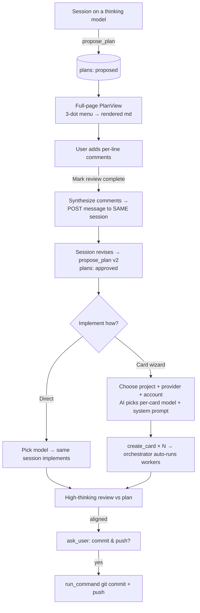

# Planning, Review & Implementation Flow

> Proposal / implementation plan. Status: DRAFT v2 (2026-07-09) — scope expanded to chat-session planning, thinking-model gate, AI card wizard, per-line comments, and commit/push.

## 1. Goals (verbatim intent, consolidated)

1. **Durable plans.** A session (worker **or** regular chat) can build a plan. The plan is saved and survives model switches, termination, and `clear_session`. Reachable from the 3-dots menu (card **and** session); disabled when none; opens a **full-page rendered markdown** view with diagrams/visuals.
2. **Thinking-only planning.** Planning is unavailable to non-thinking models (avoid hallucinated solutions). A high-thinking model proposes plans.
3. **Human review of the proposed plan.** After a plan is proposed, the user can add **per-line comments**. On "mark review complete", the plan is revised per the comments **by the same session** that proposed it (retains context).
4. **Two ways to implement a plan** (chosen "when I want the plan implemented"):
   - **Direct**: pick a model, implement.
   - **Card wizard**: create cards in a project. Wizard chooses project + provider + account; the AI picks the **best model per card** and the **correct system prompt** per card.
5. **Post-implementation review.** After implementation (direct or via cards), a **high-thinking model reviews the work and verifies alignment with the plan**. On completion it **asks the user whether to commit and push**.

## 2. Grounded facts (from code)

- **Plan storage**: durable data belongs in the DB. `clear_session` only truncates a session's events/todos (`routes/sessions/mod.rs::clear_session_core`); Card/table rows survive.
- **Thinking models**: `ModelInfo { id, display_name, capabilities: Vec<String>, tier: i32 }` (`provider/stream.rs`). No single flag — Claude Opus/Fable expose `"reasoning"`, Sonnet/Haiku don't; Ollama can report `"thinking"`; Cursor encodes `…-thinking-…` in the id. → add a normalized `is_thinking(model_id)` helper + expose `thinking: bool` to the frontend.
- **AI picks model/prompt per card today**: `create_card` MCP tool already accepts `model`, `effort`, `system_prompt_name`, `model_autoswitch`, `workflow`, `depends_on` (`schemas.rs`, `handlers/cards.rs`). Chats keep `create_card` (`routes/mcp.rs` role visibility). `get_model_guidance` + `list_models` let the AI enumerate candidates (with capabilities/tier) and system prompts.
- **System prompts**: `system_prompts` table + `resolve_system_prompt(name)`; 7 seeded (`implement/research/debug/review/docs/fable 5`). Workers apply `card.system_prompt_name` at spawn (`orchestrator.rs`).
- **Autoswitch review already exists**: worker step-1 prompt tells it to write a plan, switch down, then `switch_session_model` **up** with `compact:true` + `system_prompt_name:"review"` and review before finishing (`worker/pipeline.rs`, `handlers/model_control.rs`).
- **Injection point**: `handover.rs::take_pending_injection` (dispatch chokepoint) prepends a one-shot doc to the next turn — where we inject the plan into the review turn.
- **Feedback → session**: `POST /api/sessions/:id/message { text }` (`routes/sessions/dispatch.rs`).
- **Git**: the `git` MCP tool is **read-only** (`exec_tools.rs` GIT_READONLY). Commit/push must go via `run_command` — approval-gated for chats, auto-approved for workers. **Guardrail: commit/push always requires explicit `ask_user` confirmation regardless of session type.**
- **ask_user**: MCP tool → `question` event → UI controls → `question-resolved` → auto-resume (`handlers/misc.rs`, `routes/sessions/events.rs`).
- **No per-line comment infra** anywhere (diff-viewer has none). Must build: table + core full-page React view.
- **UI**: card menu = inline buttons (`KanbanBoard.tsx`); session menu = `MenuButton`+`MenuItem[]` (`ChatView.tsx`); full-page sub-views routed in `App.tsx`; markdown via `SafeMarkdown.tsx`; **mermaid not installed**.

## 3. Data model

````
plans
 ├─ id              TEXT pk
 ├─ session_id      TEXT   -- creator session (worker or chat)
 ├─ card_id         TEXT?  -- set when the creator is a worker on a card
 ├─ project_id      TEXT?
 ├─ title           TEXT
 ├─ markdown        TEXT   -- the plan body (md + ```mermaid)
 ├─ status          TEXT   -- proposed | commenting | revising | approved | implementing | implemented | reviewed
 ├─ version         INT    -- bumped on each revise
 ├─ created_at / updated_at

plan_comments
 ├─ id              TEXT pk
 ├─ plan_id         TEXT fk
 ├─ anchor          TEXT   -- line number or stable text anchor in markdown
 ├─ body            TEXT
 ├─ resolved        BOOL   -- set when folded into a revision
 ├─ created_at

sessions
 └─ pending_plan_review  BOOL default false   -- one-shot: inject the plan into the next (review) turn
````

Lookups: card menu → `plans WHERE card_id = ?`; session menu → `plans WHERE session_id = ?`. A dedicated table (vs. columns on Card+Session) is chosen because plans now belong to _sessions or cards_, carry a lifecycle/status, are versioned, and own child comments.

## 4. Flows



## 5. Milestones

### M0 — Foundations

- Migrations: `plans`, `plan_comments` tables; `sessions.pending_plan_review` column. `db/repair.rs` `ensure_*` fallbacks (per AGENTS.md ADD COLUMN/table rule). `db/models.rs`, `db/schema.rs`, `db/crud/plans.rs` (new).
- `provider/registry.rs` (or a `models.rs` helper): `is_thinking(model_id, &registry) -> bool` from capabilities (`reasoning`/`thinking`) + id heuristic; add `thinking: bool` to the `list_models`/ModelInfo JSON so the frontend can gate.

### M1 — Plan authoring + persistence

- New MCP tool `propose_plan { title?, markdown }`:
  - **thinking-gated** — reject if the session's current model is non-thinking (error tells the model to switch to a thinking model first),
  - available to workers **and** chats,
  - writes/updates the `plans` row (links `card_id`/`project_id` for workers), bumps `version`, emits a `plan-proposed` event,
  - schema `schemas.rs`, handler `handlers/plans.rs` (new), register `mod.rs`, visibility `routes/mcp.rs`.
- `worker/pipeline.rs`: autoswitch step-1 prompt → "write the plan, then call `propose_plan` to save it (md + mermaid) before switching models."
- Persistence verified against model switch / termination / `clear_session`.

### M2 — Full-page viewer + 3-dot menu

- `types/api.ts`: `Plan`, `PlanComment` types; `Card`/`Session` gain `has_plan`/`plan_id` (light) — or fetch on demand via `GET /api/plans?card_id=` / `?session_id=`.
- Card menu (`KanbanBoard.tsx`) + session menu (`ChatView.tsx`): **Plan** item, `disabled` when no plan, → `navigate(view, id, 'plan:'+planId)`.
- `App.tsx`: parse `plan:<id>` sub-view (projects + sessions) → new `components/PlanView.tsx` (full page, `SafeMarkdown`, Back).
- `components/MermaidBlock.tsx`: lazy `import('mermaid')`, render ` ```mermaid ` fences; add `mermaid` dep.

### M3 — Per-line comments + revise-in-session

- Routes `routes/plans.rs`: `GET/POST/DELETE /api/plans/:id/comments`; `POST /api/plans/:id/review-complete` (synthesizes unresolved comments → posts a message to `plan.session_id` via the existing dispatch path, marks comments resolved, sets status `revising`).
- `PlanView`: gutter comment affordance per line, comment list, "Mark review complete" button. Comments persisted (survive reload) until resolved.
- Same session revises → calls `propose_plan` again (version++), status → `approved` when user accepts.

### M4 — Post-implementation review + commit/push

- Reuse the autoswitch switch-back: in `handlers/model_control.rs::switch_session_model`, when `compact && system_prompt_name=="review"` and a plan exists, set `sessions.pending_plan_review=true`.
- Dispatch chokepoint (`handover.rs`): when set, load the plan and prepend a one-shot **"review the work against this plan"** directive + `<plan>…</plan>`; clear the flag.
- Direct-implementation path: after implementing, ensure the reviewing turn runs on a **high-thinking** model (switch up if needed) with the plan injected.
- On review pass → `ask_user` "Commit and push?" → on yes, `run_command` git commit + push. **Explicit-confirmation guardrail enforced for all session types.**

### M5 — Implement-a-plan actions (direct + card wizard)

- `PlanView` (status ≥ approved): actions **Implement with model…** and **Create cards…**.
- **Direct**: model picker (thinking-capable filter optional) → switch the plan's session to that model → send an "implement this plan" directive.
- **Card wizard** (new multi-step modal, first stepper in the app — build a small `Wizard` shell):
  1. choose **project** (existing active project in folder, or create new),
  2. choose **provider + account** (from `list_models`/`/api/*-accounts`),
  3. the planning session (on a **high-thinking** model — AI selects if not already) proposes the **card breakdown**, choosing per-card `model` (best for the work, within the chosen provider/account), `system_prompt_name`, `effort`, `depends_on`,
  4. user reviews/tweaks the proposed cards, confirms → `create_card × N`,
  5. orchestrator auto-spawns workers (existing).
- Planning/plan-proposing UI affordances are **hidden/disabled for non-thinking models**.

### M6 — Tests

- **Rust**: plans/plan_comments CRUD; `propose_plan` thinking-gate (reject non-thinking); review-switch sets `pending_plan_review` and injected text contains the plan; `review-complete` posts a message to the creator session; commit/push requires confirmation.
- **Mock**: `mock:plan-review` scenario in `provider/mock/mod.rs` that persists a plan via the real crud path, emits switch signals, review text, finish. Add a thinking-capable mock model + a non-thinking one to exercise the gate.
- **Playwright** `e2e/tests/plan-flow.spec.ts` (may split): worker path (plan saved → survives clear_session → review injection); chat path (propose_plan → PlanView renders → per-line comment → review-complete revises); menu disabled when no plan; wizard creates cards → workers spawn; commit/push confirm dialog; **cleanup: `DELETE /api/projects/:id`** + delete chat session.
- Gate: `peckboard/scripts/verify.sh`.

## 6. Locked decisions

1. Parent/reviewer = the **original/stronger (thinking) model** via the existing autoswitch switch-back; for chat, switch up to a high-thinking model for review.
2. Plans live in a dedicated **`plans` table** (not columns), with `plan_comments` + a one-shot `sessions.pending_plan_review` flag.
3. Plan item in **card AND session** 3-dot menus.
4. Planning is **thinking-model-gated** (tool rejects + UI hides for non-thinking).
5. Card creation is **AI-driven** via the existing `create_card` (per-card model + `system_prompt_name`); wizard supplies project/provider/account.
6. **`mermaid`** added, lazy-loaded.
7. **Commit/push always requires explicit `ask_user` confirmation**, executed via `run_command` (git tool stays read-only).

## 7. Open decisions (need your call)

- **A. Planning entry point in a chat session**: a dedicated "Plan mode" toggle on the composer, vs. the model calls `propose_plan` when the user asks it to plan (no UI mode).
- **B. Direct implementation**: run in the **same** planning session (switch its model), vs. spawn a **new** session for implementation.
- **C. Build order**: everything sequentially M0→M6, vs. ship an **MVP first** (M0–M2 + the worker review injection) then comments/wizard/commit later.

## 8. Risks

- Mock events don't hit real MCP handlers → the e2e needs a mock scenario that persists via crud (M6).
- "Thinking" detection is heuristic across providers; needs a maintained allow-signal (`reasoning`/`thinking` capability + id parse).
- Per-line comment UI on rendered markdown (anchoring comments to lines through markdown→HTML) is the trickiest UI piece; may anchor to source-markdown line numbers shown in a split/raw view.
- Commit/push from an agent is high-consequence — the confirmation guardrail is mandatory, not optional.
- `switch_session_model` 3-switch cap interacts with down→up→(review) sequences.
- Scope is large; M5 (wizard) is the biggest single lift.
