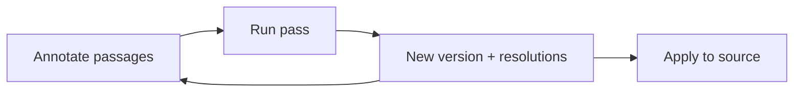

# Document Review

A _review_ is a pass over one markdown document — a file in a registered folder, a report an agent wrote, or a saved plan — where you annotate passages and an AI session revises the document until you approve it. The document and your annotations live in PeckBoard, every revision is kept as a version, and nothing touches the original until you apply the result.

## Annotate, Run, Repeat

Open a review and select any passage: a popover offers the annotation kinds — comment, suggest, wrong, expand, shorten — plus clarify, which asks the reviewer a question instead of marking the text. Annotations collect in a rail beside the document, each anchored to the lines it was made on.

Run a pass and the reviewer session receives the document with your open annotations. It revises the document — which becomes a new version — and resolves each annotation with a note saying what it did: fixed, declined with a reason, or answered. When it needs your call, it asks an inline question anchored to the passage it is asking about, and the review waits in a needs-input state until you answer. You can stop a run mid-pass, and an in-flight review survives a server restart.

The reviewer is an ordinary session: the chat lane on the review screen shows its transcript, you can message it directly, and a model picker in the header chooses which model reviews — switch it between passes and the same session continues on the new model.

## Versions and History

History is append-only. Every revision — the reviewer's or your own edits — is a new version with a note, and the history tab shows each one with a diff against its predecessor. Reverting copies an old version to a new head rather than rewriting anything, so the trail of what changed and why stays intact.

Apply writes the current version back to the source — the file, report, or plan the review was created from — and finishing marks the review approved. Deleting a review removes the review, its versions, and its annotations; the source document is untouched.

## Reviewing Files From a Repository

The creation wizard picks the source. For a repository it cascades repo → worktree → file, so you can review a document exactly as it stands on a card's working branch — useful when a worker wrote docs on a branch that has not merged yet. Reports and plans are picked from their own lists.

GitHub pull request comments as annotations

A file review can be linked to a GitHub pull request. Review comments on that PR import as annotations — anchored to the same lines, marked with their origin — and when the reviewer resolves one, the reply is posted back to the PR thread. Sync runs both directions on demand, and unlinking detaches the review without deleting anything on either side.

Where reviews fit with workers and reports

Workers write [reports]({{ "/core-concepts.html#reports" | relative_url }}) and plans as part of working cards; a review is how those documents get read critically before they are trusted. The reviewer session uses the same MCP tools as any agent — it fetches the review document, submits revisions, and asks questions through the same machinery workers use, so everything it does shows up in its transcript.

