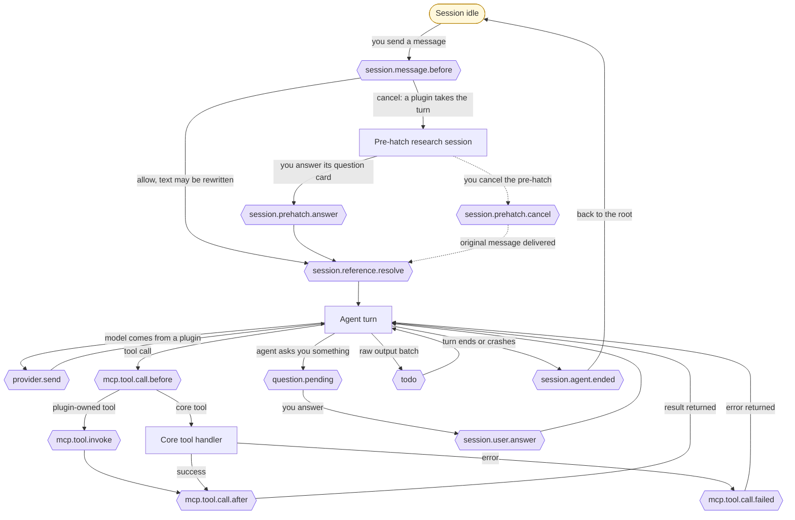
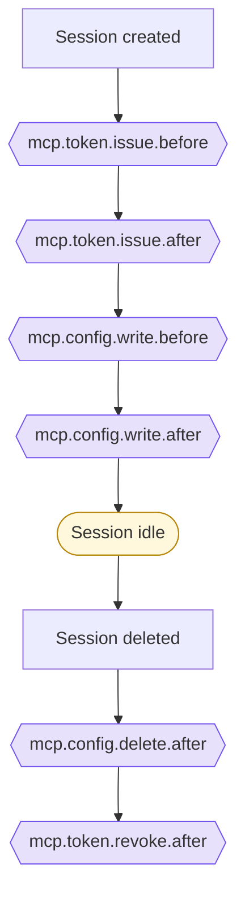
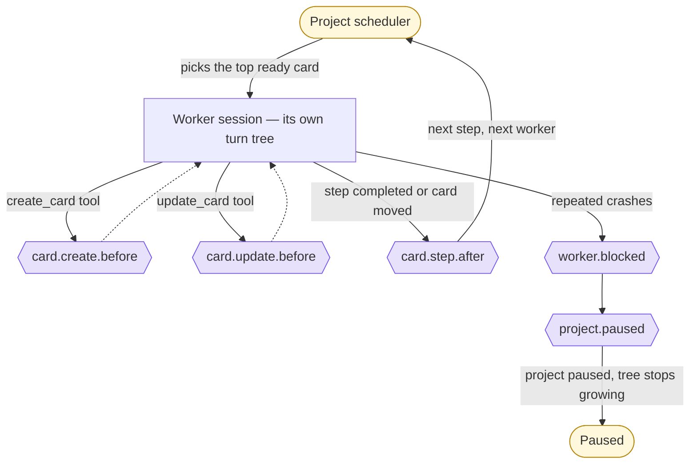

# Session Hooks

A _hook_ is a point where PeckBoard pauses what it is doing and hands the moment to an installed plugin — to observe it, veto it, rewrite it, or own it outright. This page maps every hook onto the life of a session, drawn as a tree: the trunk is the session moving from idle through a turn and back, the shoots are hooks, and several shoots loop back into the trunk rather than ending.

## The Turn Tree

Everything starts and ends at an idle session. Sending a message grows the tree downward — through message hooks, into the agent's turn, out to tool calls — and every completed turn is a shoot that bends all the way back to the root.





Reading down the trunk: `session.message.before` fires before a chat message reaches the agent — a plugin may rewrite the text or take the whole turn, which is how [pre-hatcher]({{ "/plugins.html" | relative_url }}#pre-hatcher) works; its question cards come back through `session.prehatch.answer` and `session.prehatch.cancel`, both of which bend back to the trunk by delivering a message. `session.reference.resolve` lets a plugin expand a `session:` reference in the text into something richer. During the turn, every tool call passes `mcp.tool.call.before`, is answered either by the plugin that owns the tool (`mcp.tool.invoke`) or by core, and reports back through `mcp.tool.call.after` or `mcp.tool.call.failed` — then the shoot rejoins the turn. Questions to you fan out through `question.pending` and return as `session.user.answer`. When the turn finishes, `session.agent.ended` fires and the tree folds back to the root, idle again.

Observing hooks versus owning hooks

Most hooks _observe_ an operation core is performing: the plugin can allow it, cancel it, or modify its payload, and core carries on. Four hooks instead hand the plugin the _whole operation_: `mcp.tool.invoke` (the plugin's own tool call — core only routes and scopes it), `provider.send` (one full agent turn on a plugin-registered model), and the two HTTP hooks described below. Notification hooks — `question.pending`, `session.agent.ended`, `todo`, and the board notifications — ignore the verdict entirely; by the time they fire, the thing has happened.

The `todo` hook is the odd shoot: for providers that are themselves plugins, each batch of raw agent output is offered to a `todo`-hook plugin, which can distill it into the session's current work-item list — the same list the Claude provider extracts natively.

## Setup and Teardown

The turn tree only exists because the session was wired up first. When a session that talks to the MCP server is created, its access token and config file pass through hooks on the way in — and on the way out when the session is deleted.





`mcp.token.issue.before` can veto issuing the session's bearer token, and `mcp.config.write.before` can modify the MCP config the agent will launch with; their `.after` counterparts, and the delete/revoke pair, are notifications.

## Around the Board

A worker session grows the same turn tree, but its shoots also reach the board — and the board loops back to the root harder than anything else: every completed step returns control to the project scheduler, which grows a fresh tree for the next step or card.





`card.create.before` and `card.update.before` fire whether the change comes from a worker's tool call or from you in the UI, and can veto or adjust the card. `card.step.after` is the loop-back shoot: each step advance returns to the scheduler. The two right-hand shoots are the emergency exit — repeated crashes fire `worker.blocked` together with `project.paused`, and that branch does not return.

## Outside the Tree

Four hooks are not part of any session's tree. `http.request.before` and `http.request.authed` serve plugin HTTP routes — public `/plugin-api/*` and signed-in `/api/plugin-ui/*` respectively — where the plugin owns the request end to end; this is how plugin pages like the diff viewer exist. `provider.register` fires at startup and whenever the plugin set changes, asking each provider plugin to register its models. `card.priorities.list` fires when the priority options are listed, letting a plugin add to them.

Every hook at a glance

| Hook                        | Fires                                          | Plugin can                         |
| --------------------------- | ---------------------------------------------- | ---------------------------------- |
| `session.message.before`    | Before a chat message reaches the agent        | Rewrite the text, or take the turn |
| `session.prehatch.answer`   | You answer a pre-hatch question card           | Own the outcome                    |
| `session.prehatch.cancel`   | You cancel an in-flight pre-hatch              | Own the fallback delivery          |
| `session.reference.resolve` | A `session:` reference appears in a message    | Replace it with custom text        |
| `provider.send`             | A turn runs on a plugin-registered model       | Own the entire turn                |
| `mcp.tool.call.before`      | Before any MCP tool call                       | Cancel it or modify the arguments  |
| `mcp.tool.invoke`           | A plugin-owned tool is called                  | Own the call and return its result |
| `mcp.tool.call.after`       | A tool call succeeded                          | Observe                            |
| `mcp.tool.call.failed`      | A tool call failed                             | Observe                            |
| `question.pending`          | A session surfaces a question for you          | Observe                            |
| `session.user.answer`       | You answer an `ask_user` question              | Observe                            |
| `todo`                      | A batch of raw plugin-provider output arrives  | Report the session's work items    |
| `session.agent.ended`       | An agent run completes or crashes              | Observe                            |
| `mcp.token.issue.before`    | Before a session's MCP token is issued         | Cancel                             |
| `mcp.token.issue.after`     | After the token is issued                      | Observe                            |
| `mcp.token.revoke.after`    | After the token is revoked                     | Observe                            |
| `mcp.config.write.before`   | Before the session's MCP config is written     | Cancel or modify the config        |
| `mcp.config.write.after`    | After the config is written                    | Observe                            |
| `mcp.config.delete.after`   | After the config is cleaned up                 | Observe                            |
| `card.create.before`        | Before a card is created                       | Cancel or adjust the fields        |
| `card.update.before`        | Before a card is updated                       | Cancel or adjust the fields        |
| `card.step.after`           | After a card changes step                      | Observe                            |
| `card.priorities.list`      | When priority options are listed               | Add or modify options              |
| `worker.blocked`            | A card's crashes pause its project             | Observe                            |
| `project.paused`            | A project pauses (manual, crash, or budget)    | Observe                            |
| `provider.register`         | Startup, or the plugin set changes             | Register a provider and models     |
| `http.request.before`       | A public `/plugin-api/*` request arrives       | Own the request and response       |
| `http.request.authed`       | A signed-in `/api/plugin-ui/*` request arrives | Own the request and response       |

