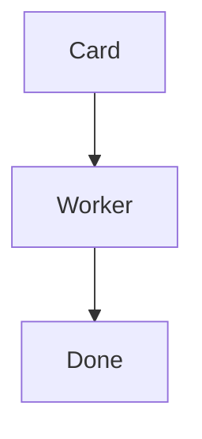

# Style Guide

Every page on this site follows the contract below. This page follows it too, so each section both states a rule and demonstrates it.

## High Level First, Depth on Demand

Open every page with two or three sentences a reader can absorb without scrolling. Move deeper material into an expandable block or a linked sub-page so the main flow stays short. A page that needs more than a few screens of scrolling should be split.

<details markdown="1">
<summary>How to write an expandable block</summary>

Use an HTML `<details>` element with a `<summary>` line, and add `markdown="1"` so Markdown inside it still renders:

```html
<details markdown="1">
  <summary>One-line label for what is inside</summary>

  Body text, code blocks, and lists all work here.
</details>
```

This block is itself the working example: it collapsed until you opened it.

</details>

## Descriptive, Not Promotional

State what the software does. Never rate it — no "revolutionary", "amazing", "powerful", or any adjective whose job is praise rather than information.

| Bad                                                                     | Good                                                                |
| ----------------------------------------------------------------------- | ------------------------------------------------------------------- |
| PeckBoard's powerful expert system gives you amazing answers instantly. | An expert session answers questions about one part of the codebase. |

## Prose, Not Bullet Dumps

Explain things in short paragraphs, the way this page does. A bullet list is acceptable only for items that are genuinely a list — command-line flags, file names — never for prose chopped into fragments. If you are tempted to bullet three rules, write three short sentences instead.

## Plain Words Before Jargon

When a PeckBoard term is unavoidable, define it in plain words the first time it appears, then give one example sentence. For instance: an _expert_ is a long-running session that has read one part of the codebase and answers questions about it, as in "the worker asked the docs expert where screenshots live." Likewise a _worker session_ is an agent launched to complete one card on the board. A reader should never need another page to decode the current one.

## Code and Diagrams

Use a code example when it is shorter than the paragraph it replaces, and a diagram when it makes a structure or flow easier to hold in mind. Diagrams are written as fenced Mermaid blocks, which this site renders directly. This is the canonical syntax:

````text

````

And this is how it renders:


## Images

Screenshots live in `assets/screenshots/`, named in kebab-case after what they show (`kanban-board.png`, not `screenshot-1.png`). Give every image alt text that describes the state on screen, not the filename. Embed with the `relative_url` filter so links keep working if the site's `baseurl` ever changes — it is empty today, with the site served from the root of <https://peckboard.com>:



```liquid

```



## Front Matter

Every page starts with YAML front matter carrying `title` (the name shown in the sidebar) and `nav_order` (an integer position there). The just-the-docs theme also accepts `parent` and `has_children` to nest pages, and `nav_exclude: true` to keep a page out of the sidebar entirely. The `title` matches the page's single `#` heading, and all headings use Title Case, the same rule the rest of this repository follows.

```yaml
---
title: Style Guide
nav_order: 7
---
```
